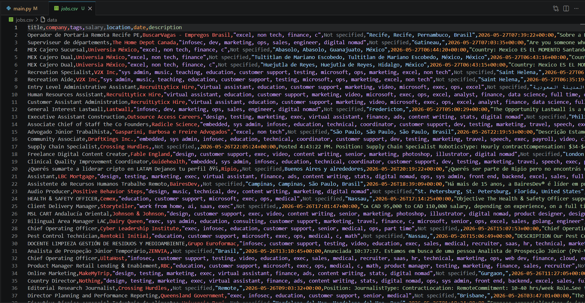

# RemoteOK Job Scraper

A Python-based web scraping project that extracts remote job listings from the RemoteOK public API and exports clean structured data to CSV format.

---

## Features

- Extracts:
  - Job Title
  - Company Name
  - Tags / Skills
  - Salary Information
  - Job Location
  - Posting Date
  - Full Job Description

- Cleans malformed text and encoding issues
- Removes HTML tags from job descriptions
- Converts API data into structured CSV format
- Uses API-based scraping instead of traditional HTML scraping

---

## Technologies Used

- Python
- Requests
- Pandas
- BeautifulSoup4
- ftfy

---

## Project Structure

```bash
remoteok-job-scraper/
│
├── main.py
├── requirements.txt
├── sample_jobs.csv
├── preview.png
├── .gitignore
└── README.md
```

---

## Installation

```bash
pip install -r requirements.txt
```

---

## Usage

```bash
python main.py
```

---

## Output

The scraper exports job data into a CSV file:

```bash
jobs.csv
```

A smaller sample dataset is also included:

```bash
sample_jobs.csv
```

---

## Preview



---

## Sample Data

| Title | Company | Location |
|---|---|---|
| Python Developer | Company X | Remote |
| Backend Engineer | Company Y | USA |

---

## Notes

This project uses the RemoteOK public API for educational and portfolio purposes only.